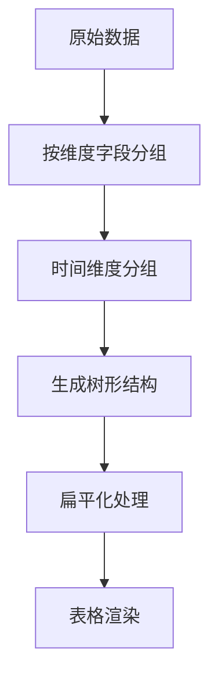

根据提供的代码内容，整理技术文档如下：

# 多维数据分析组件文档

## 一、功能概述
本组件实现以下核心功能：
- 动态多维数据分组（年/季/月/周）
- 树形表格展示与交叉统计
- 可视化图表展示（柱状/折线/饼图）
- 动态列配置与数据过滤
- 数据导出与AI智能分析
- 多维度合并表头支持

## 二、技术栈
```markdown
- **前端框架**: Vue3 + VxeTable + Day.js
- **可视化**: 自定义ChartComponent
- **工具库**: Lodash + Currency.js
- **状态管理**: LocalStorage持久化
- **AI集成**: 智谱大模型API
```

## 三、核心模块说明

### 1. 数据分组处理器 (DateHook)
```javascript
class DateHook {
  year() { /* 按年分组逻辑 */ }
  quarter() { /* 按季度分组逻辑 */ }
  month() { /* 按月分组逻辑 */ }
  week() { /* 按周分组逻辑 */ }
}
```

### 2. 表格配置
```javascript
const tableConfig = ref({
  border: true,
  loading: false,
  scrollY: { enabled: true },
  treeConfig: {
    transform: true,
    rowField: '_id',
    parentField: '_parentId'
  },
  footerMethod // 底部统计方法
});
```

### 3. 动态列管理
| 配置项        | 说明                          |
|---------------|-----------------------------|
| defaultColumns | 预定义的45个业务字段            |
| fieldModel    | 分组维度字段（支持多级嵌套）      |
| field2        | 统计指标字段（支持多字段）        |

### 4. 图表系统
```vue
<ChartComponent 
  ref="chartRefs" 
  :id="item" 
  @render="renderChartHook"/>
```

## 四、关键方法说明

### 1. 数据分组处理流程


### 2. AI分析流程
```
用户输入 --> 模型API请求 --> 返回JSON配置 --> 自动设置维度 --> 重新查询
```

## 五、待办事项(TODO)
```markdown
- [ ] 完善导出功能表头
- [ ] 实现字段合并分析
- [ ] 优化列定位算法
- [ ] 添加平均计算功能
- [ ] 多维度表头性能优化
```

## 六、配置参数说明
| 参数名          | 类型     | 默认值   | 说明                     |
|-----------------|----------|---------|--------------------------|
| FIELD_BY_TIME   | String   | createTime | 时间分析基准字段         |
| SPLIT_CHAR      | String   | _        | 字段分隔符               |
| INTERVAL        | Number   | 300      | 防抖间隔(ms)            |

## 七、性能指标
- 数据分组耗时：`{{ times }}ms`
- 支持数据量级：10万+（需开启虚拟滚动）
- 内存占用：约50MB/万条数据

## 八、使用示例
```javascript
// 典型配置
fieldModel.value = ['region', 'productCategory'];
field2.value = ['salesVolume', 'profit'];
```

## 九、注意事项
1. 时间字段需符合ISO8601格式
2. 统计字段需为数值类型
3. 分组层级建议不超过3级
4. 图表渲染需等待表格数据就绪

